# JAWABAN PRAKTIKUM QUEUE
## 8.2.3 
1.	Iya karena tidak menunjuk ke data manapun.
2.	Maksud dari potongan kode tersebut yaitu kondisi dimana kita sudah mendapatkan data data untuk mengecek apakah posisi rear berada pada I deks terakhir array .jika benar,maka posisi rear selanjutnya adalah di indeks 0.
3.	Yaitu pada kode:
* 
4.	Yaitu pada baris kode program :
* 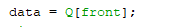
5.	Maksud dan kegunaan dari potongan kode tersebut yaitu mengecek apakah posisi FRONT saat ini berada di indeks terakhir array.jika benar ,maka FRONT selanjutnya diletakkan di indeks 0.
6.	Iya karena pada operasi Queue ini proses dilakukan dengan cara me-loop semua isi array dari indeks front sampai rear.Looping tidak selalu mulai dari indeks ke-0 karena front tidak selalu berada di indeks ke-0.
7.	Maksudnya yaitu mengecek setiap elemen dari front smpek rear,selama nilai hasil bagi itu = 0 selagi hasil i dimodulokan nilai maxnya belum = 0 maka tetap dicetak atau lanjut lagi.
## 8.3.3
1.	Yaitu menginisialisasikan nilai atau isi pada konstruktor berparameter pada class penumpang yaitu pada kode program Penumpang(String nama, String kotaAsal,String kotaTujuan,int jml, int harga) {
2.	Pada kode program eror dan saat di jalankan sampai inputan enqueue masih bisa jalan namun saat memilih pilihan lain eror atau tidak bisa dijalankan.Mengapa demikian karena itu merupakan inisialisasi objek penumpang untuk menginisialisasi konstruktor berparameter pada class penumpang.
3.	* 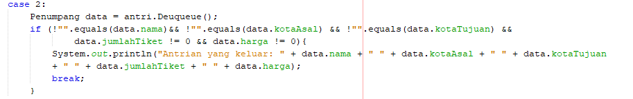
4. * 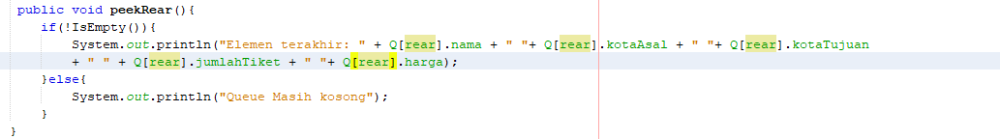
* 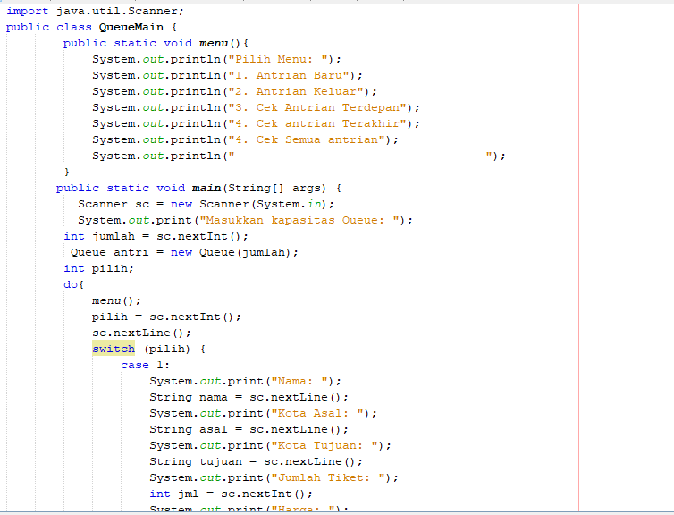
* 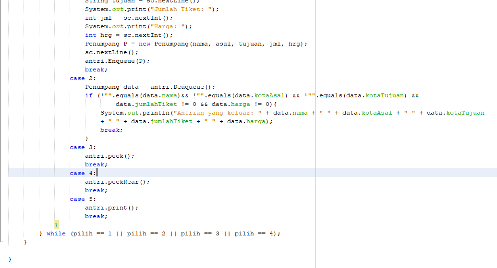
* 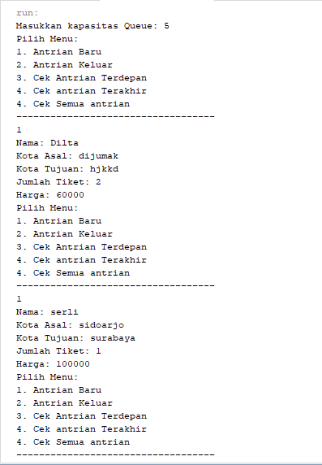
* 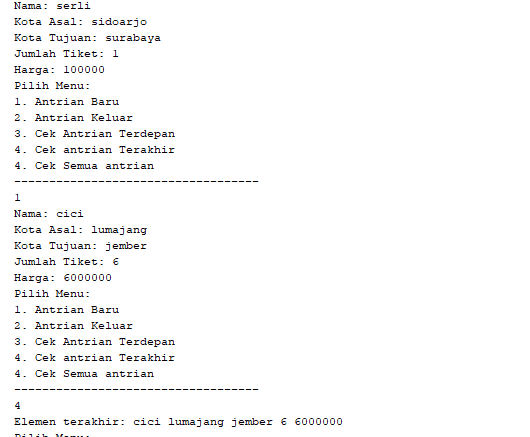

## Tugas
1. * 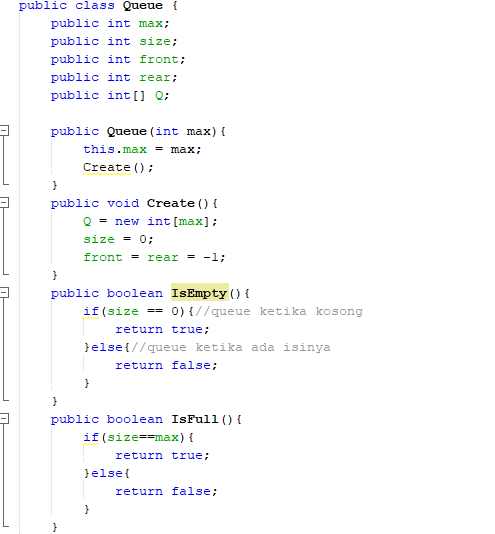
* 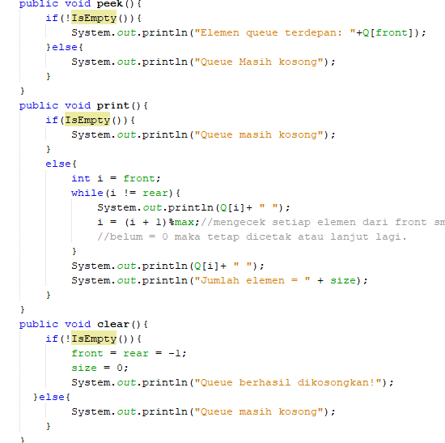
* 
* 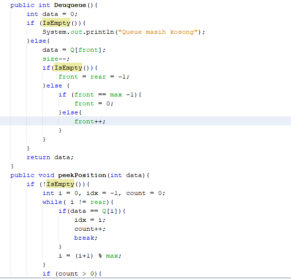
* 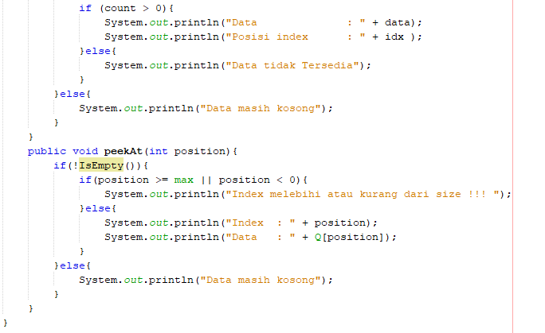
* 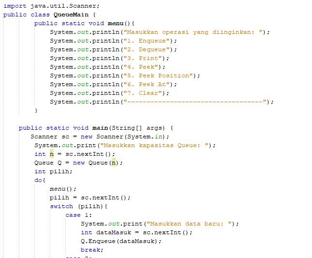
* 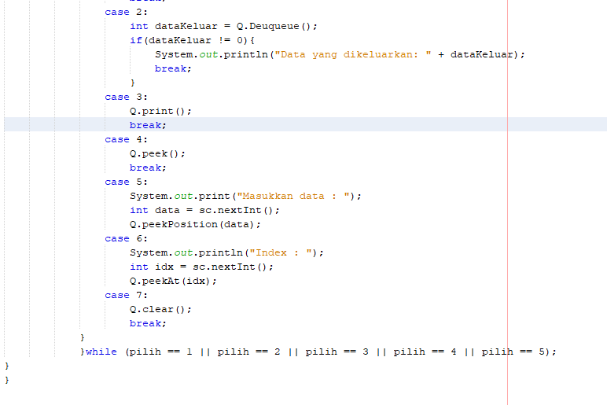
* 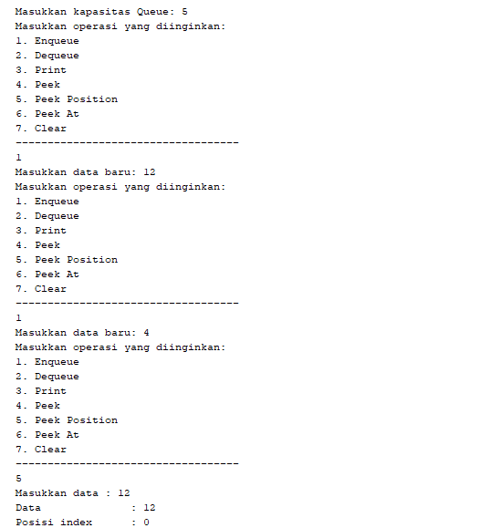
* 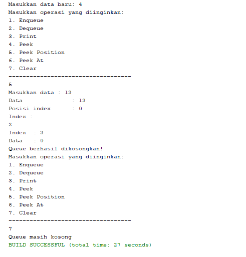

2.
 * 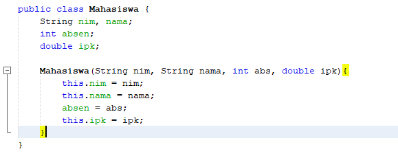
* 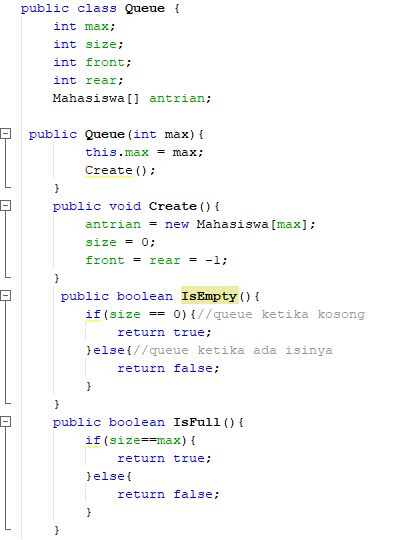
* 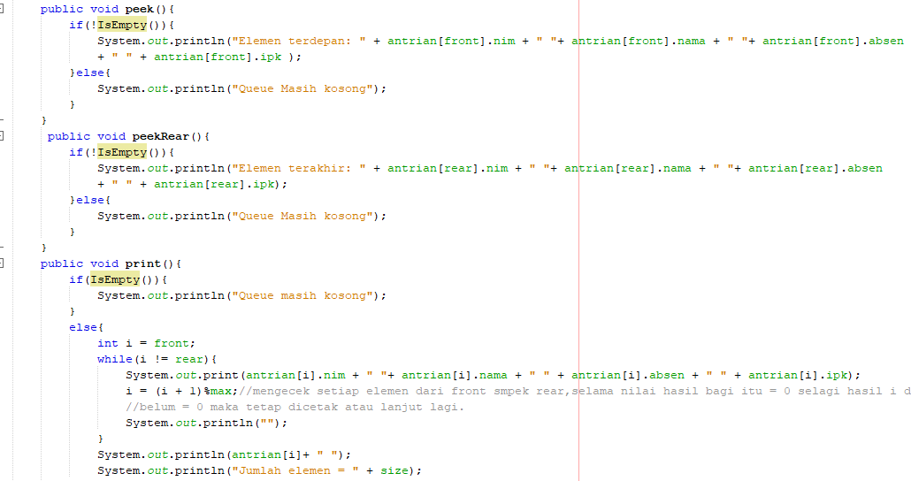
* 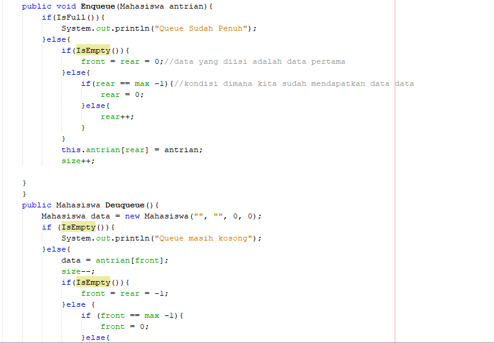
* 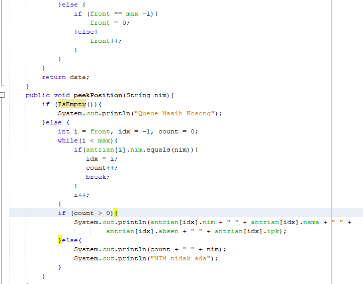
* 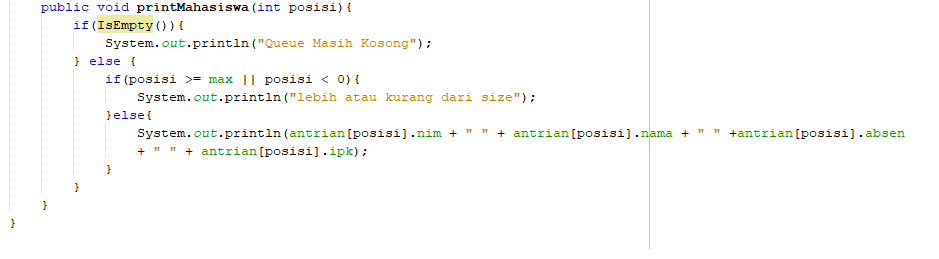
* 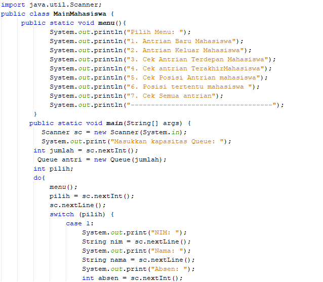
* 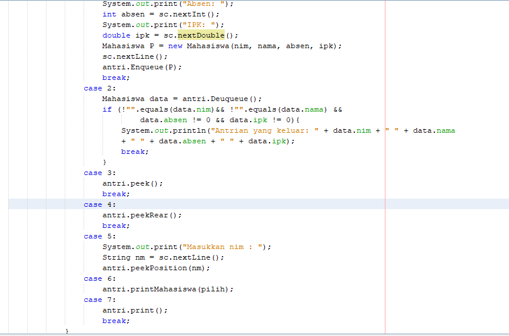
* 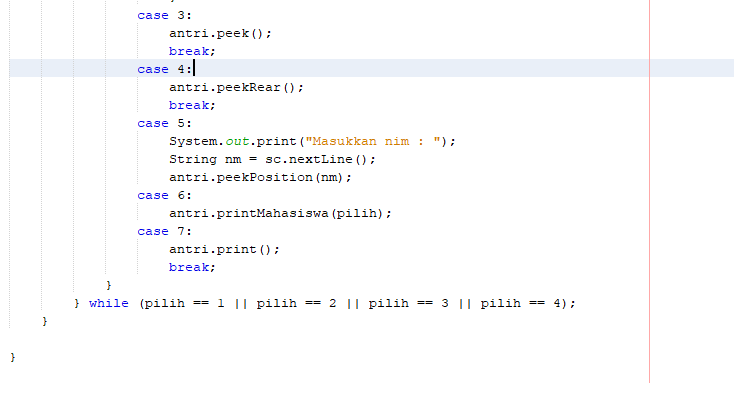
* 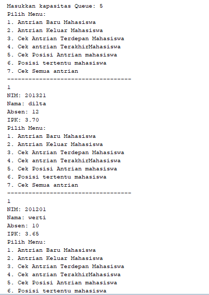
* 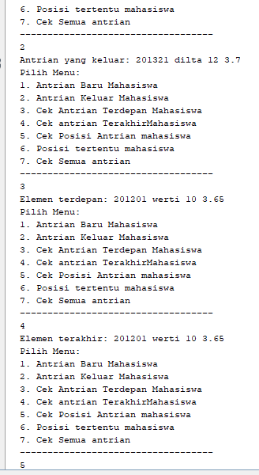
* 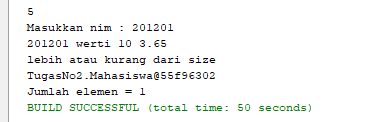
