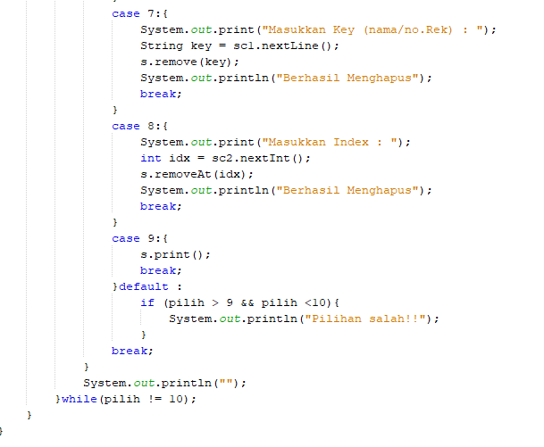
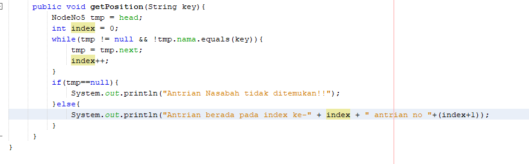
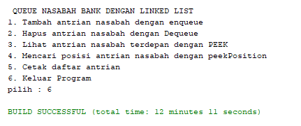

# jawaban pertanyaan praktikum single linked list
## jawaban 9.2.3
### 1. iya karena pada pemanggilan di class main pertama yaitu method print() sedangkan data masih kosong atau belum diisi jadi pada method print() masuk ke kondisi yang else atau yang memiliki println Linked List Kosong.
### 2. maksud dari kode tersebut yaitu untuk penambahan node setelah node yang memiliki data sama dengan key.
### 3. kode tersebut yang ada pada method insertAt yaitu untuk jika data yang sama dengan null atau masih tidak ada isinya maka ditambahkan pada bagian tailnya.
## jawaban 9.3.3
### 1. agar program tidak mengalami error karena pada remove break digunakan untuk 1 kali remove.
### 2. yaitu untuk mengecek jika terdapat key atau tidak .
### 3. nilai kembalian atau return -1 yang digunakan untuk ketika nilai tidak ada pada list sedangkan return index berarti nilai terdapat di dalam list.

# Tugas
## 1.
class Node 
* 
class SLL
* 
* 
* 
* 
* 
* 
main SLL
* 
output
* 
## 2.
class Node
* 
class SLL
* 
* 
* 
class main
* 
* 
output
* 
* 
## 3.
class Node
* 
class SLL
* 
* 
* 
class main
* 
output
* 
* 
## 4.
class Node
* 
class SLL
* 
* 
* 
* 
* 
class main
* 
* 
* 
* 
output
* 
* 
* 
* 
* 
## 5.
class Node
* 
class SLL
* 
* 
* 
class main
* 
* 
output
* 
* 
* 
* 
* 
