# jawaban pertanyaan percobaan praktikum
## 13.2.2 percobaan praktikum 1
### 1. karena pada binary search tree setiap child node sebelah kiri selalu lebih kecil nilainya daripada root node.begitu pula sebaliknya,setiap child node sebelah kanan selalu lebih besar nilainya daripada root node.Alasan harus dibedakan kiri dan kanan sesuai besaran nilainya,tujuannya untuk memberikan efisiensi terhadap proses searching.Maka jika struktur data tree sudah tersusun rapi sesuai aturan mainnya,proses search akan lebih cepat dan efektif.
### 2. kegunaannya yaitu cabang baru pada setiap node ketika kita sudah memanggil suatu node baru dan akan membuat cabang dari node tersebut kita dapat memasukkan node baru tersebut ke atribut left/right.
### 3. 
#### a. root(akar) merupakan node khusus di dalam tree yang tidak memiliki induk/parent.Root digunakan untuk sebagai node yang pertama kali ditambahkan ketika ada penambahan node di dalam class, dan juga sebagai penunjukkan pada node current pada proses pencarian.
#### b. root memiliki derajat keluar >= 0 dan derajat masuk = 0
### 4. ketika true masih kosong,proses yang akan terjadi selanjutnya adalah menambahkan method add() di dalam class BinaryTree. jika tidak kosong maka akan ada proses perbandingan.Proses penambahan node tidak dilakukan secara rekursif,agar lebih mudah dilihat alur proses penambahan node dalam tree.
### 5. if (data<current.data) merupakan pembandingan data, kondisi yang akan melakukan pengecekan apakah data yang dimasukkan kurang dari data yang ditunjuk oleh variabel current saat ini? Jika iya, maka akan berlanjut ke kondisi kedua, yaitu if(current.left != null),yaitu untuk mengecek apakah current tersebut memiliki data left atau child? jika iya maka akan mengeksekusi perintah current = current.left yang artinya bahwa current yang ditunjuk akan dipindahkan ke child sebelah kirinya.Namun jika kondisinya tidak terpenuhi, maka akan mengeksekusi perintah else yang isinya current.left = new Node(data) yaitu perintah untuk melakukan instansiasi penambahan Node baru sebagai child disebelah kiri  dari current data.kemudian perulangan akan diakhiri menggunakan perintah break.
## 13.3.2 pertanyaan percobaan praktikum 2
### 1. kegunaan atribut data yaitu untuk menyimpan data misal angka yang dimasukkan tersebut berapa saja. Untuk atribut idxLast yaitu untuk menunjukkan index array yang terakhir.
### 2. kegunaan method populateData() yaitu untuk mengisikan datanya.
### 3. untuk mencetak seluruh data pada subtree kiri lalu bagian rootnya dan setelah itu mencetak subtree bagian kanan.
### 4. left child di index 5 dan right child nya index ke 6.

### 5. kegunan dari statement int idxLast = 6 yaitu untuk nilai panjang arraynya.

# Tugas praktikum
1.
* 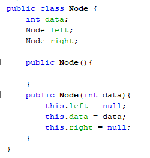
* 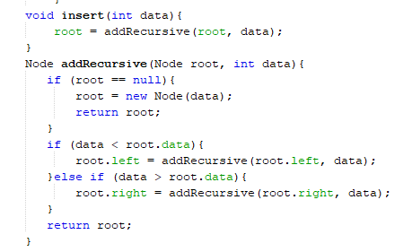
* 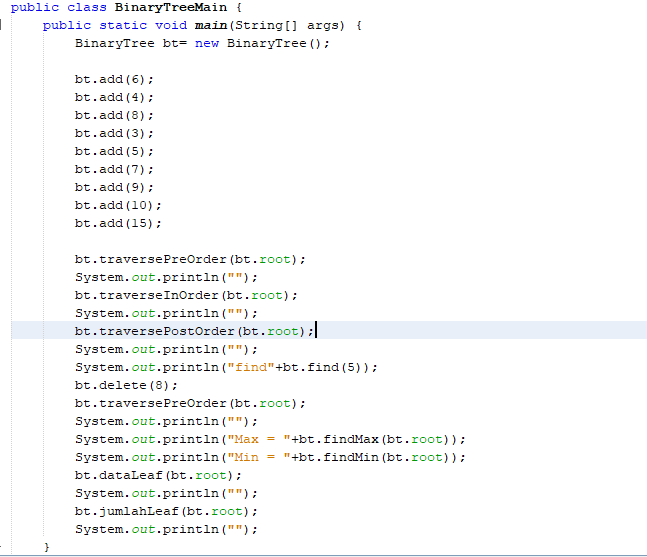
* 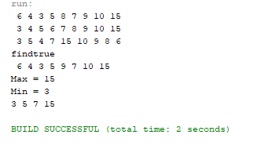
2.
* 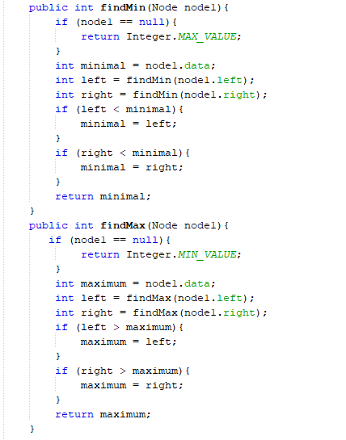
* 
* 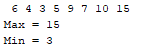
3.
* 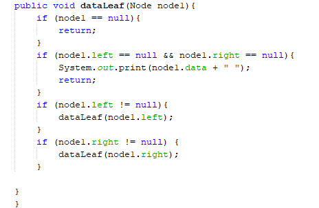
* 
* 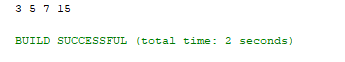
4.
* 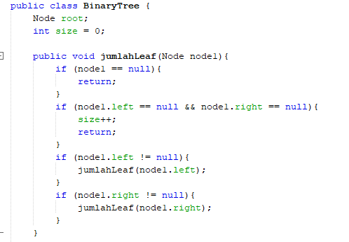
* 
* 
5.
* 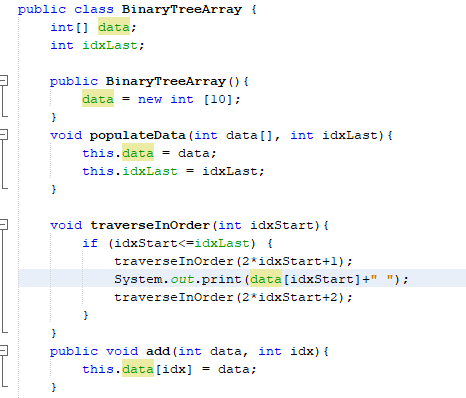
* 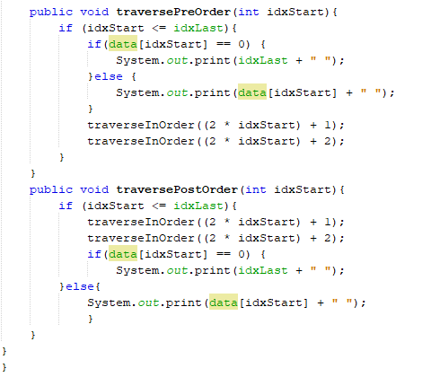
* 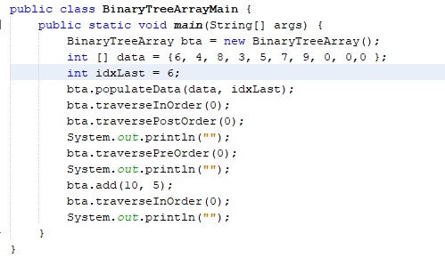
* 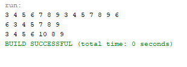