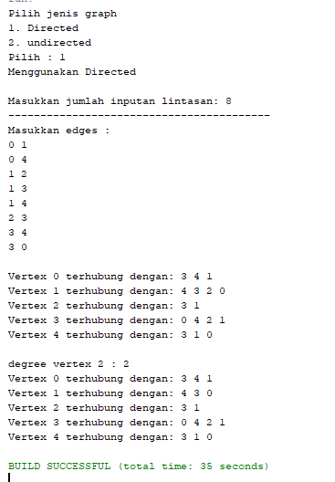
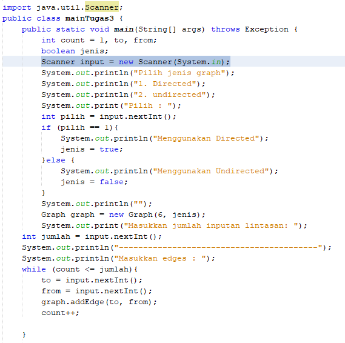
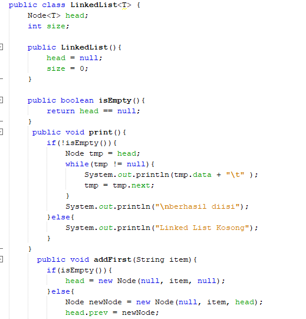

# Jawaban pertanyaan percobaan praktikum
## Praktikum 1
### jawaban 14.2.3
#### 1.	Sebutkan beberapa jenis (minimal 3) algoritma yang menggunakan dasar Graph, dan apakah kegunaan algoritma-algoritma tersebut? 
Jawaban: 

a.	BFS : Digunakan sebagai algoritma pencarian 

b.DFS : Digunakan sebagai algoritma pencarian 

c.	Algoritma Bellman-Ford = Untuk menemukan lintasan terpendek 

d.	Algoritma Boruvska= Untuk menentukan pohon penjangkau minimum 
#### 2.	Pada class Graph terdapat array bertipe LinkedList, yaitu LinkedList list[]. Apakah tujuan pembuatan variabel tersebut ? 
Jawaban: Untuk memanggil fungsi linked list dan mengisi list yang berupa vertex pada linked list tersebut. 
 
#### 3.	Apakah alasan pemanggilan method addFirst() untuk menambahkan data, bukan method add jenis lain pada linked list ketika digunakan pada method addEdge pada class Graph? 
Jawaban: Untuk mengenalkan pertama kali vertex tersebut dan juga koneksinya. 
 
#### 4.	Bagaimana cara mendeteksi prev pointer pada saat akan melakukan penghapusan suatu edge pada graph ? 
Jawaban: Dengan cara melakukan looping vertex. Jadi, jika vertex lebih besar dari (i) dan destination sama dengan (i) maka edge akan otomatis dihapus. 
 
#### 5.	Kenapa pada praktikum 12.2 langkah ke-12 untuk menghapus path yang bukan merupakan lintasan pertama kali menghasilkan output yang salah ? Bagaimana solusinya 
jawaban :
Output yang dikeluarkan tidak error namun data vertex yang dilewati mengalami perubahan path / lintasan. 
### jawaban pertanyaan percobaan 14.3.3
#### 1.	Apakah perbedaan degree/derajat pada directed dan undirected graph? 

Jawaban: Pada directed graph degree mempengaruhi bobot pada edge antar vertex (bobotnya tidak sama antara A ke B dan B ke A). Sedangkan undirected graph degree tidak mempengaruhi bobot (bobot antara A ke B dan B ke A nilai bobotnya sama). Jika pada directed graph degree nya bisa berbeda untuk derajat  in dan out nya ,pada undirected maka degree nya sama 
 
#### 2.	Pada implementasi graph menggunakan adjacency matriks. Kenapa jumlah vertices harus ditambahkan dengan 1 pada indeks array berikut? 
Jawaban: Karena vertex dimasukkan ke dalam matriks sedangkan pada matriks indeks pertama dimulai dari 0. Maka, agar vertex dalam matrix sama dengan vertex yang aslinya harus di +1. 
 
#### 3.	Apakah kegunaan method getEdge() ? 
Jawaban: Kegunaan method getEdge() adalah untuk menampilkan apakah vertex tersedia atau tidak di dalam graph. 
 
#### 4.	Termasuk jenis graph apakah uji coba pada praktikum 12.3 ? 
Jawaban: Jenis graph tersebut termasuk ke dalam adjacency matrix yaitu directed graph. 
 
#### 5.	Mengapa pada method main harus menggunakan try-catch Exception ? 
Jawaban: Karena untuk menangani proses penanganan error agar program tetap berjalan meskipun ada error serta agar tidak terjadi hang. 

# TUGAS
### 1.
* 
* 
* 
* 
* 
* 
* 
* 
* 
* 
* 
### 2.
* 
* 
* 
* 
* 
* 
* 
### 3.
* 
* 
* 
* 
### 4.
* 
* 
* 
* 
* 
* 
* 
* 
* 
* 
* 