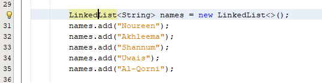
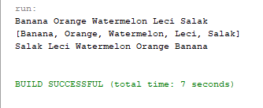
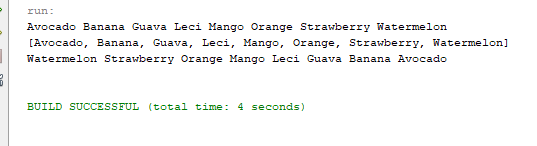

# Jawaban pertanyaan Praktikum
## Praktikum 1
1. Karena ArrayList dapat menampung sejumlah data secara dinamis, sehingga seberapapun jumlahnya 
akan ditampung oleh ArrayList tanpa memperhatikan berapa jumlah maksimal elemen yang dapat ditampung dan tanpa memperhatikan tipe datanya. Jadi jika ingin menampung satu tipe data harus 
digunakan “< >” dan di dalam kurung dituliskan tipe data yang igin ditampung.
2. modifikasi:
* 
3. modifikasi:
* 
4. modifikasi
* 
5. hasilnya:
* 
menurut saya hasil setelah di modif Jika menggunakan list maka tidak akan dapat menggunakan method yang ada pada linked list sedangkan 
menggunakan linked list dapat menggunakan method yang ada pasa list.
## Praktikum 2
* 
* 
* 
 1. Add dimiliki oleh class interfacenya, sedangkan push dimiliki oleh class stack.
 2. hapus pada baris 43 dan 44
 * 
 mengapa demikian Karena data yang diretieve akan kosong
 3. Perulangan yang digunakan untuk mendeklarasikan dan mencetak nilai dari variabel fruit.
 4. Error karena push hanya terdapat pada class stack.

5. modifikasi

6. Tambahkan 3 buah seperti “Mango”,”guava”, dan “avocado” kemudian dilakukan sorting! 

## Praktikum 3
#### 1. Pada fungsi tambah() yang menggunakan unlimited argument itu menggunakan konsep apa? Dan 
kelebihannya apa? 

Jawab : 
Menggunakan Variable Arguments yang dapat menambahkan data pada parameter lebih dari satu
#### 2. Pada fungsi linearSearch() di atas, silakan diganti dengan fungsi binarySearch() dari collection! 

3. Tambahkan fungsi sorting baik secara ascending ataupun descending pada class tersebut! 

# Tugas Praktikum
### 1. Implementasikan stack menggunakan collection dengan contoh kasus tumpukan buku perpustakaan

### 2.Buatlah implementasi program daftar nilai mahasiswa semester, minimal memiliki 3 class yaitu 
Mahasiswa, Nilai, dan Mata Kuliah. Khusus untuk data Mahasiswa dan Mata Kuliah harus sudah 
diinisialisasi, sehingga ketika memasukkan data nilai data mahasiswa dan mata kuliah cukup 
menginputkan nim ataupun kode mata kuliah. Yang paling penting adalah antara objek 
mahasiswa, matakuliah, dan nilai harus saling terhubung.

