# Jawaban praktikum algostruk:
## 2.2.2
1.  iya bisa
## 2.2.3: 
1.	karakteristik class/objek  yaitu Attribute (state) dan Behavior (method).
2.	Kata kuncinya yaitu “class” lalu diikuti nama classnya.
3.	Ada 4 atribut yaitu namaBarang,jenisBarang,stok,hargaSatuan.pada baris ke 17 sampai 20.
4.	Ada 4 method yaitu tampilbarang,tambahStok,kurangiStok, dan hitungHargaTotal.pada baris 16,23,27,31.
5. 
* 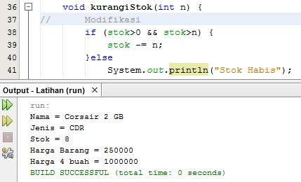	
6.	Iya supaya hanya bisa dikurangi dengan 1 nilai dan harus bertipe int karena harus jelas berapa yang dikurangi misal 3 jadi jelas stok yang dikurangi 3.
7.	Iya karena harus jelas berapa harga totalnya nanti.
8.	Iya karena nanti nilainya akan diisikan di fungsi main.
## 2.3.3
1. proses instansiasi dilakukan pada baris 15 sampai 19.nama objek yang dihasilkan adalah 
nama = corsair 2 GB,jenis = DDR,Stok ,dan harga satuan.
2. cara mengakses atribut dan methodnya yaitu dengan memanggil fungsi yang telah ada dan mengisi nilai parameternya misal yaitu bl.tambahStok(1).
## 2.4.3
1.	Pada baris ke 25
2.	Maksud yang dilakukan pada program tersebut atau konstruktor berparameter yaitu untuk menginisialisasi dan memberikan nilai secara langsung atau melalui parameter kepada sebuah objek yaitu pada program tersebut mengirimkan Logitech ke parameter nm yang ada di fungsi Barang, lalu mengirimkan Wireless mouse ke jn, nilai 25 ke st, dan 150000 ke parameter hs.
3.  * 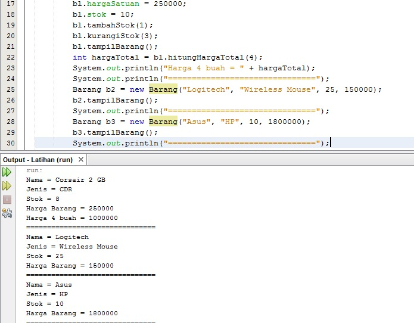

## tugas 
1. ss no.1
    * 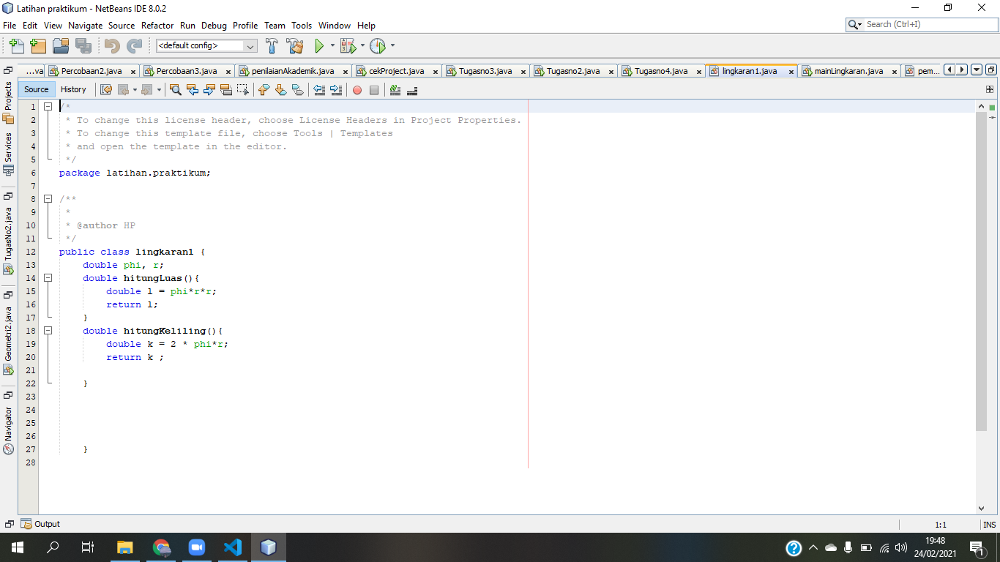
    * 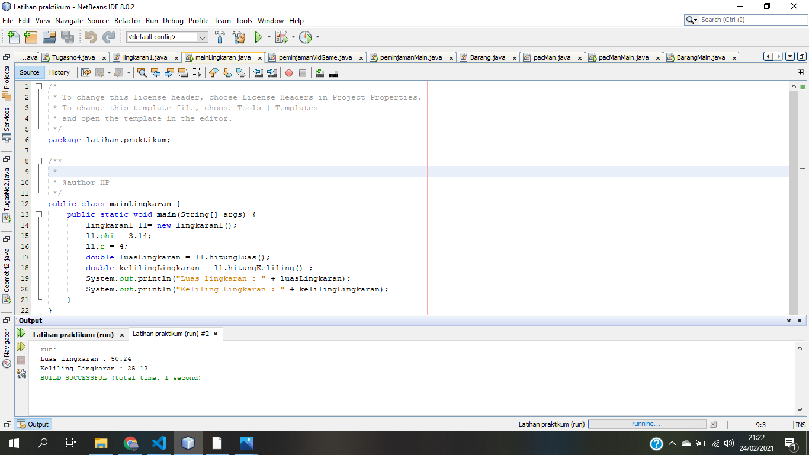
2.  ss no.2
    * 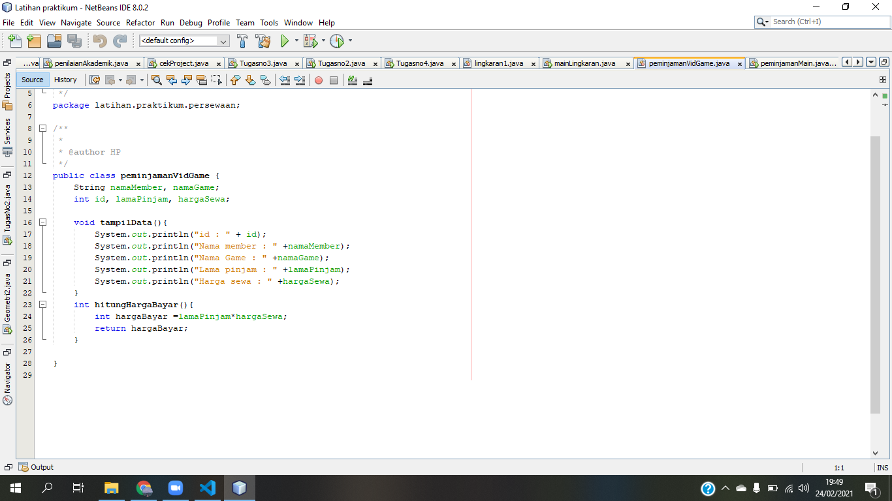
    * 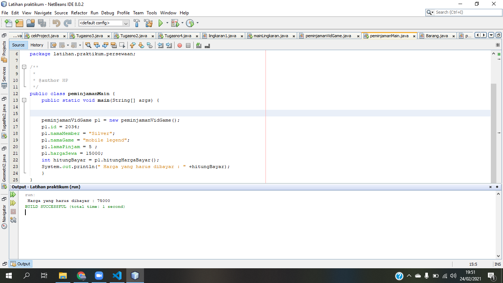
3. ss no.3
    * 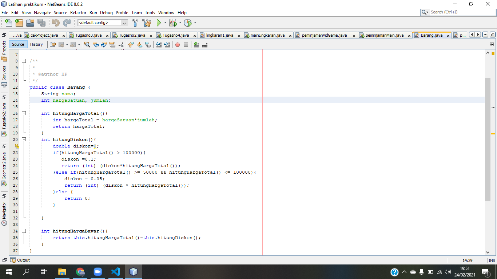
    * 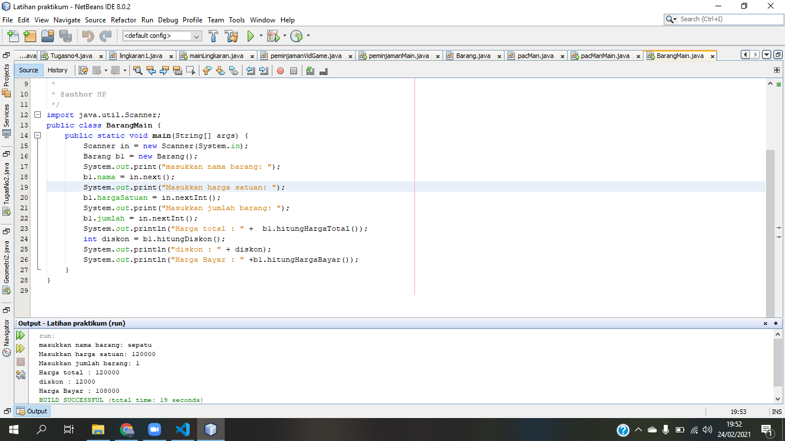
4.  ss no.4
    * 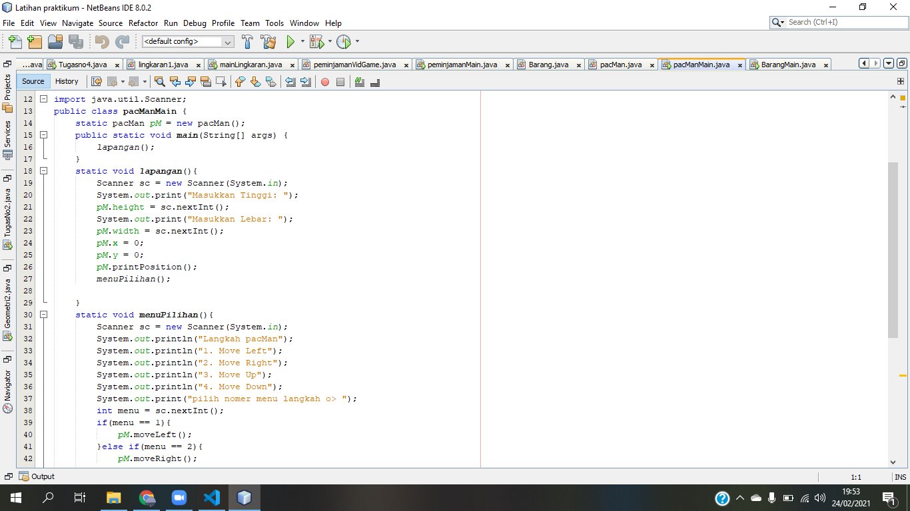
    * 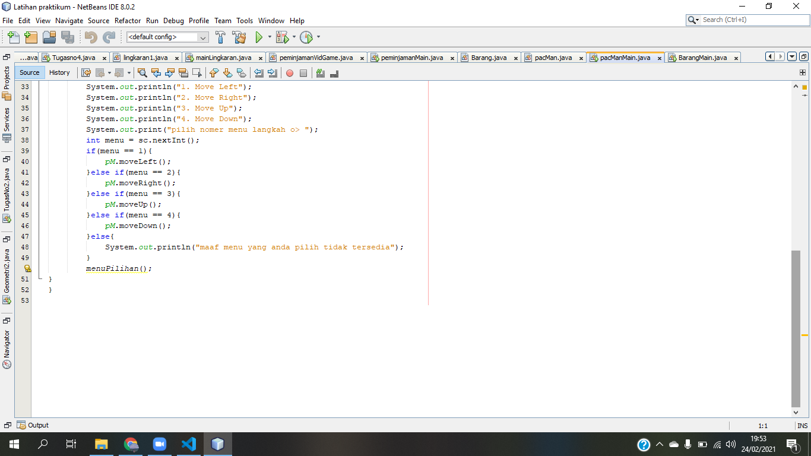
    * 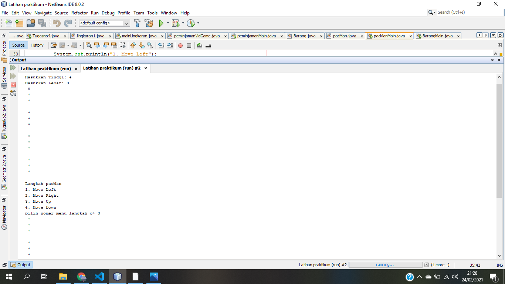
