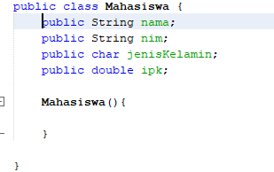

# Pertanyaan percobaan praktikum
## Jawaban pertanyaan 3.2.3
1.	Iya karena dalam sebuah class pada array of object harus ada objeknya dimana dari karakteristik objek itu memiliki sesuatu data atau atribut serta bisa melakukan sesuatu tingkah laku atau method.Jadi dalam membuat array of object harus ada atribut dan methodnya.
2.	Tidak,karena jika tidak dibuat objek persegiPanjang pada program tersebut maka akan muncul error NullPointerException pada saat program dijalankan,jadi sebelum mengisikan atribut pada objek di dalam array,sebelumnya harus dibuat objeknya terlebih dahulu.
3.	Kode tersebut merupakan deklarasi dan instansiasi pada array of object dimana persegiPanjang[] ppArray itu deklarasi untuk membuat kata kunci array misal pada program tersebut ppArray itu. Sedangkan yang instansiasi yaitu yang new persegiPanjang[3],untuk menentukan Panjang array yang akan dibuat.
4.	Kode tersebut yaitu kode untuk mengisikan atribut pada sebuah persegi atau untuk mengisikan nilai persegi Panjang pada array tersebut. 
5.	Karena supaya tau konsepnya sehingga lebih jelas dan detail dan dapat pula dimengerti.
## Jawaban pertanyaan 3.3.3
1.	Iya bisa
2.	Bisa misal contoh pada persegiPanjang persegiPanjang[][] ppArray = new persegiPanjang[2][3] maka nanti aka nada istilah baris dan kolom dimana jumlah barisnya ada 2 dan kolomnya ada 3.
3.	Karena program tersebut belum dibuat objek persegi panjangnya yaitu objeknya ppArray[5] = new persegiPanjang();
4.	Modifikasi:
* 
* 	
* 		
5.	Iya boleh.karena jika menggunakan ppArray[i] itu untuk yang perulangan sedangkan yang ppArray[0] untuk yang tidak menggunakan perulangan .
## Jawaban pertanyaan 3.4.3
1.	Iya bisa, Ketika konstruktor di overload artinya class bisa memiliki beberapa konstruktor asal parameternya berbeda-beda.contoh:
Class Buah{
String nama;
String warna;

### Buah() {
	nama = “jeruk”
	warna=”orange”
}
### Buah(String nama){
    This.nama=nama;
}
### Buah(String nama, String warna){
    this.nama = nama;
    this.warna = warna;
### }
}
### No 2,3,4 class Segitiga
* 	
5. fungsi main segitiga
* 	
output segitiga
* 
# latihan praktikum Array Of Object
## 1.Bangun Ruang
Bola:
* 
Kubus
* 
prisma segitiga
* 
Main Bangun Ruang:
* 
* 
output:
* 
## 2.Tanah
class
* 
main
* 
output:
* 
## 3.Modifikasi tanah
class
* 
main
* 
output:
* 	
## 4.Mahasiswa
class
* 	
main
* 
output:
* 
## 5. Modifikasi Mahasiswa
class
* 
main
* 	
output:
* 															
