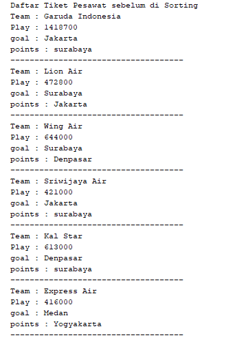

# Jawaban pertanyaan 
## percobaan praktikum:
1.	terdapat di method bubble short pada class DaftarMahasiswaBerprestasi.
2.	Masih belum ada untuk method selection sort
3.	pada kode :
    #### Mahasiswa tmp = listMhs[j];
    #### listMhs[j] = listMhs[j-1];
    #### listMhs[j-1] = tmp;
4.	Untuk melakukan pengurutan pada proses bubble sort dan ada code swap untuk melakukan pengecekan atau membandingkan data nilai itu jika pengurutannya descending maka dimulai dari yang terbesar.
5.	#### a. perbedaan antara perulangan i dan j yaitu jika i untuk perulangan data-data mahasiswa yang akan diurutkan atau misal pertama data mahasiswa atas nama nusa lalu melakukan perulangan lagi data mahasiswa Rara dan seterusnya.Sedangkan untuk perulangan j untuk melakukan perulangan pengecekan pada bubble sort yaitu untuk menjalankan proses pengurutan data bubble sort.
    #### b.   iya karena untuk i<listMhs.length-1 itu dari banyaknya data dari listMhs dikurangi 1 atau dilakukan sebanyak listMhs.length-1 dengan length adalah Panjang atau ukuran array.
    
    #### c. iya karena untuk j<listMhs.length-i itu dimana nanti perulangan akan dilakukan dari data ke-I maka pertukarannya sebanyak .length-i atau dilakukan pengecekan sebanyak data ke I dan akan dilanjutkan ke proses bubble sortnya.
    #### d.  jika ada data 50 maka perulangan i akan terjadi sebanyak data tersebut yaitu 50.dan tahap bubble sort sebanyak data tersebut sehingga nantinya sampai terurut berdasarkan data yang ascending atau descending.

    # Screenshoot hasil Latihan Praktikum :
    1.Daftar Harga Tiket Maskapai pesawat
    * 
    * 
    * 
    * 
    * 
    * 
    * 
    * 
    * 
    * 
    * 

 2 . Daftar Premier League
    * 
    * 
    * 
    * 
    * 
    * 
    * 
    * 
