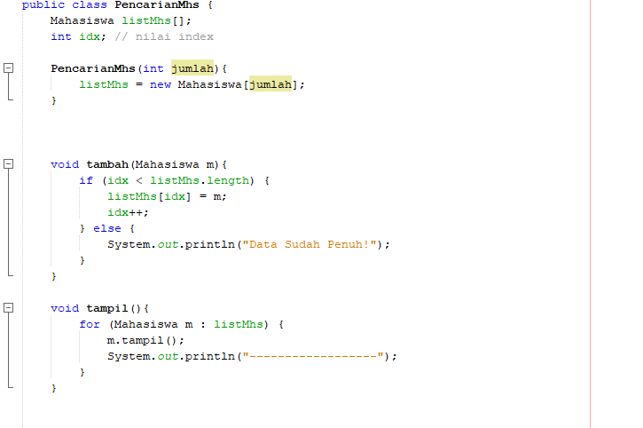
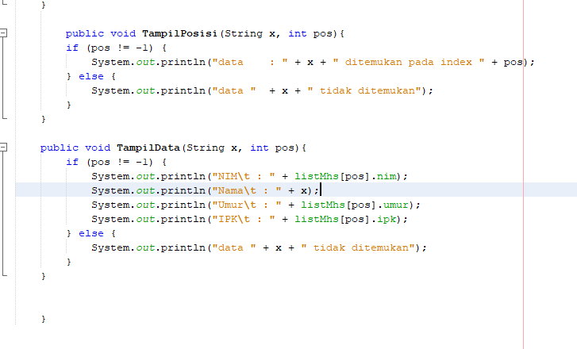

## JAWABAN PERTANYAAN PRAKTIKUM SEARCHING
### 6.2.3 
1.	Tampil data itu untuk menampilkan data apa saja yang akan dimunculkan atau atribut dari objek mahasiswa seperti nim,nama,umur,ipk dari objek mahasiswa setelah pencarian menggunakan nim tersebut.
Sedangkan tampil posisi yaitu untuk menampilkan tempat atau posisi dari data yang dicari tersebut terdapat pada indeks keberapanya.
2.	Fungsi break yaitu untuk menghentikan proses pencarian jika data yang dicari sudah ketemu ataupun jika tidak ditemukan.
3.	Program tetap dijalankan tetapi hasil dari data keseluruhan juga ikut tidak urut namun saat pencarian data tetap berjalan dengan benar jika data yang dicari ada maka outputnya data ditemukan.mengapa demikian? Karena memang kita mengurutkannya inputannya lewat keyboard atau diurutkan sendiri tidak menggunakan program pengurutan data seperti bubble sort,selection sort ,insertion sort ataupun merge sort.
### 6.3.3
1.	Pada 
    #### if (right >= left) {
    #### Mid = (left + right)/2
2.	Pada kode
    #### If(cari== listMhs[mid].nim){
    #### Return (mid)
    #### } else if (listMhs[mid].nim > cari) {
    #### Return FindBinarySearch(cari, left, mid-1);
     #### } else {
	Return FindBinarySearch(cari, mid+1, right);
}
3.	Iya masih berjalan karena binary search itu akan menggunakan metode divide conquer juga Ia akan membagi menjadi 2 terlebih dahulu atau dipecah-pecah jadi meski datanya tidak urut program tetap berjalan.
4. maka hasilnya akan tidak ditemukan meski dalam data tersebut ada data tersebut.
berikut kode yang diubah :
* 
outputnya:
* 
* 
5. modifikasi :
* 
* 
* 
* 
* 
* 
* 

## TUGAS
### 1. 
* 
* 
* 
* 
* 
* 
* 
* 
* 
* 

### 2. 
* 
* 
* 
* 
* 
* 
* 
* 

### 3.
* 
* 
* 

### 4.
* 
* 
* 
* 
* 
* 
* 
* 