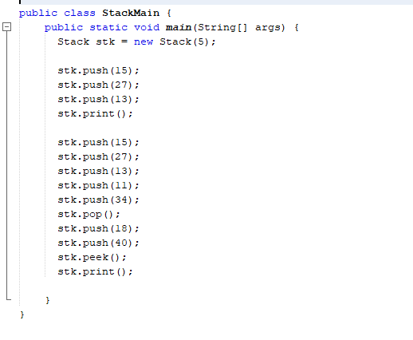
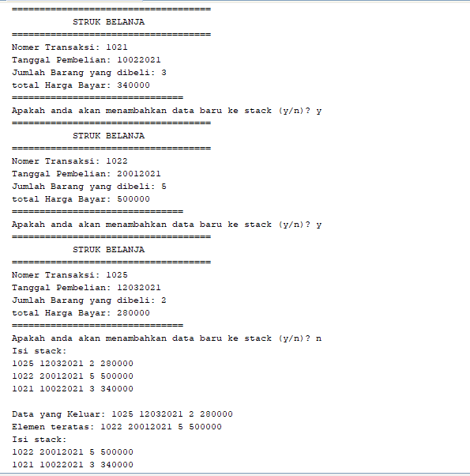

# JAWABAN PERCOBAAN PRAKTIKUM 
## Jawaban pertanyaan 7.2.3 :
1.	Untuk membatasi indeks pada stack atau membatasi jumlah isi dalam stack.
2.	Penambahan data :
* 
* 
3.	Karena jumlah batas isi stack hanya 5 jadi yang dimasukkan angka yang awal atau 18 sedangkan angka 40 tidak dimasukkan karena stack sudah penuh.
## Jawaban pertanyaan 7.3.3 : 
1.	Data yang tersimpan dari bk adalah data dari konstruktor yaitu judul, nama, tahun, jml, hrg yang ada pada instansiasi Buku bk = new Buku(judul, nama, tahun, jml, hrg).
2.	Kode program yang menunjukkan kapasitas penampungan stack yaitu :
* 
3.	Untuk mengulang apakah pengguna akan menambahkan data baru pada stack.
4.	Modifikasi:
* 
* 
* 
* 
* 
* 
* 
## Jawaban pertanyaan 7.4.3
1.	Pada method derajat alurnya saat pengguna menginputkan ekspresi matematika(infix) dimana pada ekspresi tersebut terdapat derajat operator aritmatika sehingga pada method derajat akan mengecek derajat mana saja yang ada dan urutan derajat mana yang harus didahulukan jika derajat pangkat (^) maka nilai kembaliannya berupa integer yaitu 3 dan dia akan berada paling atas. Dan seterusnya
2.	Untuk mengoperasikan ekspresi matematika pada infix dan postfix yang terdiri dari 1 variabel angka atau huruf.
3.
* 	
4.	Karena tanda kurung hanya ada di pop tidak perlu dimasukkan ke dalam postfix.

# 7.5 TUGAS
## 1.
* 
* 
* 
* 
## 2.
* 
* 
* 
* 